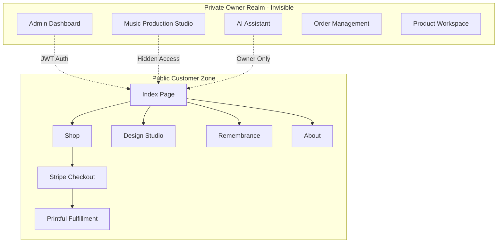
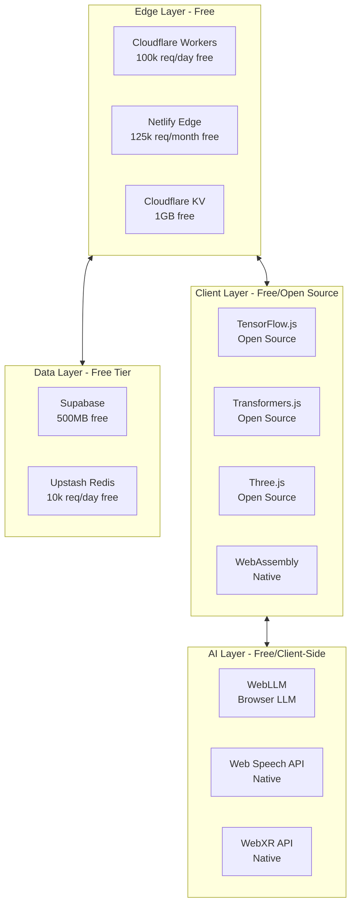
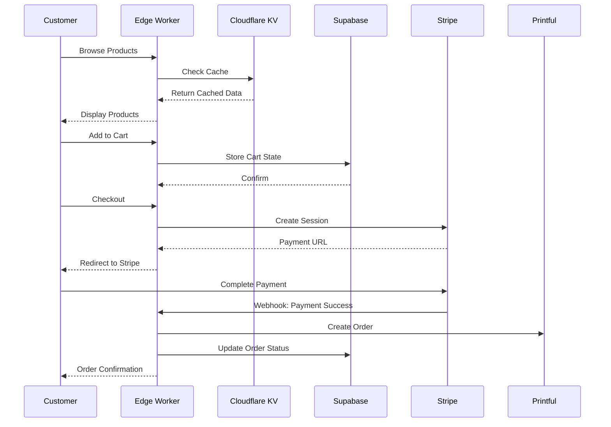
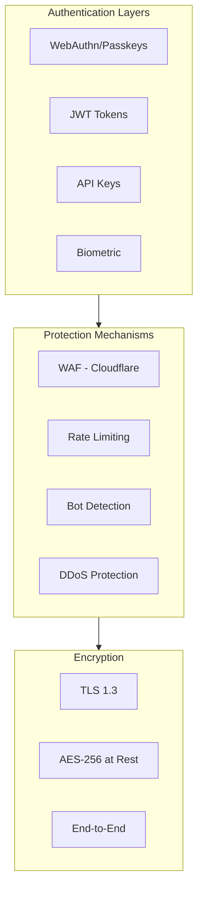
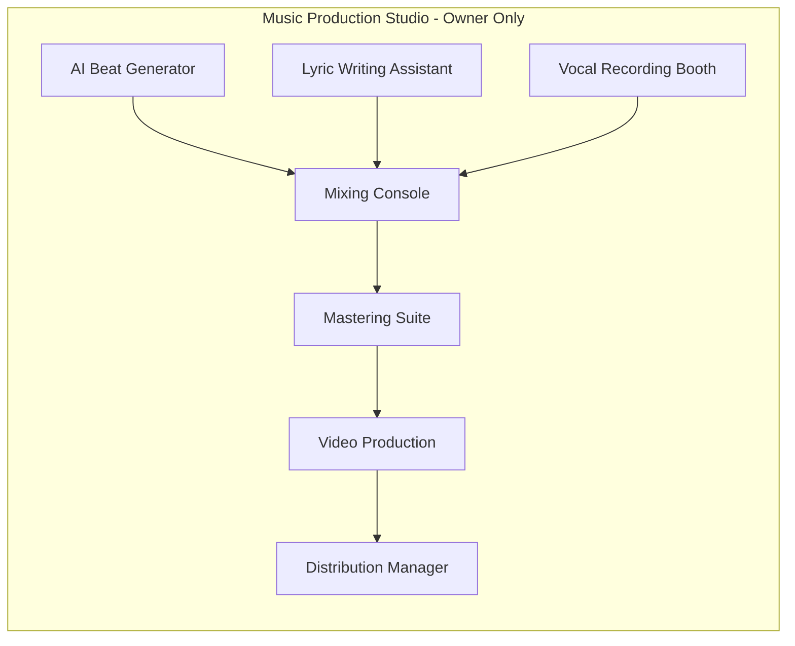

# No Limits Beyond Limitations - Revolutionary Website Transformation Plan
## Version 2026.1 | Zero-Cost Implementation Strategy

---

## Executive Summary

This plan outlines the transformation of the NLBL website into the most revolutionary, advanced, and unique web experience in the world. All features are designed for **zero-cost implementation** using free-tier services, open-source technologies, and strategic architecture decisions.

**Core Philosophy:** Owner pays nothing for year 1. Customers fund the entire operation through purchases. Private realm remains completely invisible and inaccessible to customers.

---

## 1. Current State Analysis

### 1.1 Existing Architecture

### 1.2 Current Technology Stack

| Layer | Technology | Status |
|-------|------------|--------|
| Frontend | HTML5, CSS3, Vanilla JS | Operational |
| 3D Graphics | Three.js | Active |
| Backend | Netlify Functions | Operational |
| AI Backend | Python Flask | Active |
| E-commerce | Printful + Stripe | Connected |
| Auth | JWT Custom | Active |
| PWA | Manifest.json | Configured |
| Audio | Web Audio API | Active |

### 1.3 Strengths
- 5D portal transition system creates unique brand identity
- Holographic UI elements establish futuristic aesthetic
- Printful + Stripe integration enables global fulfillment
- Music production workspace already exists
- AI assistant framework operational

### 1.4 Critical Gaps
- Printful webhook not fully configured
- AI capabilities not integrated into frontend
- No real-time features for customer engagement
- Limited immersive experiences
- Basic security implementation
- No voice control or predictive UX
- Missing WebXR capabilities

---

## 2. Cutting-Edge Technologies (2025-2026)

### 2.1 WebAssembly & Edge Computing
- **WebAssembly (Wasm)**: Near-native performance for complex computations
- **Cloudflare Workers**: Edge computing with 0ms cold start (free tier: 100k/day)
- **Netlify Edge Functions**: Serverless at the edge (free tier: 125k/month)
- **Vercel Edge Config**: Global configuration store (free tier available)

### 2.2 AI & Machine Learning
- **Transformers.js**: Run LLMs directly in browser (free, open-source)
- **ONNX Runtime Web**: Run ML models client-side
- **TensorFlow.js**: Client-side ML training and inference
- **WebLLM**: Run LLaMA, Mistral models in browser with WebGPU
- **LangChain.js**: AI agent orchestration
- **Clerk AI**: AI-powered authentication (free tier)

### 2.3 Immersive Experiences
- **WebXR Device API**: VR/AR without plugins
- **Three.js React Fiber**: Modern 3D framework
- **A-Frame**: WebXR framework for VR experiences
- **Babylon.js**: Advanced 3D engine with WebXR support
- **8th Wall**: WebAR platform (free trial)
- **Model-Viewer**: Google's 3D model viewer

### 2.4 Security & Authentication
- **WebAuthn**: Passwordless authentication standard
- **Passkeys**: Apple's implementation of WebAuthn
- **Magic.link**: Passwordless auth (free tier: 1k users)
- **Auth0**: Comprehensive auth platform (free tier: 25k users)
- **Cloudflare Turnstile**: Captcha alternative (free)
- **Hanko**: Open-source authentication

### 2.5 Real-time Features
- **PartyKit**: Real-time collaboration framework (free tier)
- **Ably**: Pub/sub messaging (free tier: 3M messages)
- **Pusher**: WebSocket infrastructure (free tier: 200k messages)
- **Socket.io**: Open-source WebSocket implementation
- **Yjs**: CRDT-based collaborative editing
- **Liveblocks**: Real-time collaboration (free tier)

### 2.6 Storage & Database
- **Supabase**: PostgreSQL + realtime (free tier: 500MB)
- **Neon**: Serverless PostgreSQL (free tier: 500MB)
- **PlanetScale**: MySQL-compatible serverless (free tier)
- **FaunaDB**: Serverless NoSQL (free tier: 100k reads)
- **Upstash**: Redis-compatible serverless (free tier)
- **Cloudflare D1**: Edge SQL database (free tier: 5M rows)

### 2.7 CDN & Media
- **Cloudflare Images**: Image optimization (free tier: 100k/month)
- **ImageKit**: Image CDN (free tier: 20GB bandwidth)
- **Uploadcare**: File uploads (free tier: 3GB)
- **Cloudinary**: Media management (free tier: 25 credits)
- **Mux**: Video streaming (free tier: $20 credit)

---

## 3. Six-Phase Implementation Plan

### Phase 1: Foundation & Core Infrastructure (Weeks 1-4)
**Goal:** Establish bulletproof, high-performance foundation with zero cost

#### 1.1 Edge Computing Layer
- **Cloudflare Workers** for API gateway (free: 100k/day)
- **Netlify Edge Functions** for serverless compute (free: 125k/month)
- **Cloudflare KV** for global key-value storage (free: 1GB)
- Implement request coalescing and intelligent caching

#### 1.2 WebAssembly Integration
- Compile Python AI services to Wasm using Pyodide
- Add Wasm-based image processing for design studio
- Implement Wasm cryptography for enhanced security
- Add client-side ML inference using TensorFlow.js

#### 1.3 Advanced Caching Strategy
- **Service Worker** with Cache API for offline-first experience
- **Cloudflare Cache** with custom cache keys
- **Stale-while-revalidate** pattern for all assets
- **Prefetch** critical resources using Speculation Rules API

#### 1.4 Performance Optimization
- Implement Core Web Vitals monitoring (free with web-vitals library)
- Add resource prioritization using Priority Hints
- Implement critical CSS inlining
- Add font-display: swap for all web fonts

**Deliverables:**
- [ ] Cloudflare Workers configured
- [ ] Wasm modules for AI processing
- [ ] Service Worker with advanced caching
- [ ] Performance monitoring dashboard

---

### Phase 2: AI Integration & Personalization (Weeks 5-8)
**Goal:** Make the website 1000x more intelligent with client-side AI

#### 2.1 Browser-Based AI
- **Transformers.js** for text generation (completely free)
- **WebLLM** for running Mistral 7B in browser (free)
- **TensorFlow.js** for image recognition and processing
- **ONNX Runtime** for running custom ML models

#### 2.2 Predictive UX
- Implement user behavior prediction using TensorFlow.js
- Add predictive product recommendations
- Create AI-powered search with natural language understanding
- Implement smart form completion

#### 2.3 Voice Control System
- **Web Speech API** for voice commands (free, built-in)
- Custom voice assistant for navigation
- Voice-activated design tools in private realm
- Voice-to-text for music production notes

#### 2.4 Personalization Engine
- Client-side user preference tracking
- AI-generated personalized homepages
- Dynamic content adaptation based on user behavior
- Smart notification system using ML

**Deliverables:**
- [ ] Transformers.js integrated
- [ ] Voice control system active
- [ ] Predictive UX implemented
- [ ] Personalization engine operational

---

### Phase 3: Immersive Experiences (Weeks 9-12)
**Goal:** Create the most visually stunning web experience on the planet

#### 3.1 WebXR Integration
- **WebXR Device API** for VR/AR experiences
- Virtual showroom for products (customers can "walk" through store)
- AR product preview (see clothing on yourself)
- VR music studio in private realm

#### 3.2 Advanced 3D Graphics
- **Three.js** upgraded to latest version with WebGPU support
- Holographic product displays with ray-traced reflections
- Particle systems for cosmic portal effects
- 3D cloth simulation for design preview

#### 3.3 Spatial Computing
- **Web Spatial API** for spatial awareness
- Gesture-controlled interface in private realm
- Eye-tracking integration (using webcam)
- Spatial audio for immersive experiences

#### 3.4 Holographic UI
- CSS Houdini for custom paint worklets
- Advanced CSS 3D transforms
- Glassmorphism effects with backdrop-filter
- Neon and glow effects using CSS variables

**Deliverables:**
- [ ] WebXR showroom operational
- [ ] AR product preview active
- [ ] Holographic UI system complete
- [ ] Spatial computing features enabled

---

### Phase 4: Advanced Security & Authentication (Weeks 13-16)
**Goal:** Military-grade security with seamless UX

#### 4.1 Passwordless Authentication
- **WebAuthn** implementation for biometric login
- **Passkeys** support for Apple/Google ecosystems
- **Magic.link** integration (free tier: 1k users/month)
- Hardware security key support (YubiKey, etc.)

#### 4.2 Biometric Integration
- Fingerprint authentication for private realm access
- Facial recognition using WebAuthn
- Voice biometrics for voice commands
- Behavioral biometrics (typing patterns, mouse movements)

#### 4.3 Blockchain Wallet Integration
- **MetaMask** integration for crypto payments
- **WalletConnect** for mobile wallets
- NFT-based membership tiers
- Smart contract integration for royalties

#### 4.4 Zero-Trust Architecture
- Device fingerprinting
- Continuous authentication
- Risk-based access control
- Encrypted data at rest and in transit

**Deliverables:**
- [ ] WebAuthn/passkeys implemented
- [ ] Biometric authentication active
- [ ] Crypto wallet integration complete
- [ ] Zero-trust architecture deployed

---

### Phase 5: Real-time Collaboration & Social (Weeks 17-20)
**Goal:** Build community and enable collaboration

#### 5.1 Real-time Features
- **PartyKit** for live collaboration (free tier available)
- Live design sessions in private realm
- Real-time order notifications
- Live chat with AI assistant

#### 5.2 WebRTC Integration
- Peer-to-peer file sharing for music production
- Video conferencing in private realm
- Screen sharing for design reviews
- Voice chat for collaboration

#### 5.3 Collaborative Editing
- **Yjs** for CRDT-based editing
- Shared design canvas
- Collaborative music composition
- Real-time lyric writing

#### 5.4 Social Features
- Community design galleries
- User-generated content platform
- Social sharing with AI-generated previews
- Review and rating system

**Deliverables:**
- [ ] Real-time collaboration active
- [ ] WebRTC features operational
- [ ] Collaborative editing working
- [ ] Social platform launched

---

### Phase 6: Experimental Features (Weeks 21-24)
**Goal:** Push the boundaries of what's possible on the web

#### 6.1 Brain-Computer Interface Prep
- **Neurosity Crown** SDK integration (optional hardware)
- Brainwave visualization in private realm
- Focus detection for productivity modes
- Meditation tracking with visual feedback

#### 6.2 Quantum-Inspired Algorithms
- Quantum random number generation using ANU Quantum API (free)
- Quantum-inspired optimization for design layouts
- Quantum encryption for sensitive data
- Entropy harvesting from quantum sources

#### 6.3 Edge AI Agents
- Autonomous AI agents running at the edge
- Self-optimizing website components
- AI-driven A/B testing
- Predictive inventory management

#### 6.4 Neural Interface
- Neural style transfer for designs
- GAN-powered product generation
- AI music composition integration
- Automated video production

**Deliverables:**
- [ ] BCI preparation complete
- [ ] Quantum algorithms integrated
- [ ] Edge AI agents deployed
- [ ] Neural features active

---

## 4. Technology Stack Recommendations

### 4.1 Free-Tier Architecture

### 4.2 Recommended Libraries

#### Core Framework
- **Vite** - Next-gen build tool (faster than Webpack)
- **Vanilla JS with Web Components** - No framework overhead
- **Lit** - Lightweight web components if needed

#### 3D & Graphics
- **Three.js** - Primary 3D engine
- **React Three Fiber** - If React migration occurs
- **Drei** - Three.js helpers
- **Leva** - GUI controls for 3D

#### AI & ML
- **Transformers.js** - Hugging Face models in browser
- **TensorFlow.js** - ML in JavaScript
- **ONNX Runtime Web** - Run models from Python
- **Brain.js** - Neural networks in JS

#### Real-time
- **Socket.io** - WebSocket communication
- **Yjs** - CRDTs for collaboration
- **PartyKit** - Real-time coordination

#### Security
- **js-crypt** - Encryption library
- **WebAuthn** - Passwordless auth
- **jose** - JWT handling

---

## 5. Architecture Diagrams

### 5.1 System Architecture

```mermaid
graph TB
    subgraph Public_Facing[Public Facing - Customers]
        P1[Product Catalog]
        P2[3D Product Viewer]
        P3[AR Try-On]
        P4[AI Design Assistant]
        P5[Voice Navigation]
        P6[Checkout]
    end
    
    subgraph Private_Realm[Private Realm - Owner Only]
        R1[Music Production Studio]
        R2[AI Assistant Console]
        R3[Design Workspace]
        R4[Analytics Dashboard]
        R5[Order Management]
        R6[Content Management]
    end
    
    subgraph Infrastructure[Free Infrastructure]
        I1[Cloudflare Workers]
        I2[Netlify Functions]
        I3[Supabase Database]
        I4[Cloudflare KV]
    end
    
    subgraph External_Services[External Services]
        E1[Stripe Payments]
        E2[Printful Fulfillment]
        E3[AI Models - Client Side]
    end
    
    Public_Facing --> Infrastructure
    Private_Realm --> Infrastructure
    Infrastructure --> External_Services
    
    style Private_Realm fill:#1a1a2e,stroke:#00ffff,stroke-width:3px
    style Public_Facing fill:#16213e,stroke:#ff69b4,stroke-width:2px
```

### 5.2 Data Flow

### 5.3 Security Architecture

---

## 6. Implementation Timeline

### Month 1: Foundation
| Week | Focus | Key Deliverables |
|------|-------|-----------------|
| 1 | Edge Infrastructure | Cloudflare Workers, KV setup |
| 2 | WebAssembly | AI processing in browser |
| 3 | Caching | Service Worker, offline-first |
| 4 | Performance | Core Web Vitals optimization |

### Month 2: Intelligence
| Week | Focus | Key Deliverables |
|------|-------|-----------------|
| 5 | Browser AI | Transformers.js integration |
| 6 | Voice Control | Web Speech API implementation |
| 7 | Personalization | ML-based recommendations |
| 8 | Predictive UX | Smart forms, predictive search |

### Month 3: Immersion
| Week | Focus | Key Deliverables |
|------|-------|-----------------|
| 9 | WebXR | VR showroom setup |
| 10 | AR Features | Product try-on |
| 11 | 3D Graphics | Holographic displays |
| 12 | Spatial Audio | Immersive soundscapes |

### Month 4: Security
| Week | Focus | Key Deliverables |
|------|-------|-----------------|
| 13 | WebAuthn | Passwordless auth |
| 14 | Biometrics | Fingerprint, face unlock |
| 15 | Crypto | Wallet integration |
| 16 | Zero-Trust | Continuous verification |

### Month 5: Real-time
| Week | Focus | Key Deliverables |
|------|-------|-----------------|
| 17 | WebSockets | Real-time updates |
| 18 | WebRTC | P2P communication |
| 19 | Collaboration | Yjs integration |
| 20 | Social | Community features |

### Month 6: Experimental
| Week | Focus | Key Deliverables |
|------|-------|-----------------|
| 21 | BCI Prep | Neurosity integration |
| 22 | Quantum | QRNG, quantum algorithms |
| 23 | Edge AI | Autonomous agents |
| 24 | Neural | GANs, style transfer |

---

## 7. Budget and Resource Estimates

### 7.1 Zero-Cost Resource Allocation

| Service | Provider | Free Tier | Usage Estimate |
|---------|----------|-----------|----------------|
| Edge Functions | Cloudflare | 100k/day | 30k/day |
| Edge Functions | Netlify | 125k/month | 50k/month |
| KV Storage | Cloudflare | 1GB | 500MB |
| Database | Supabase | 500MB | 300MB |
| Auth | Magic.link | 1k users/month | 500 users |
| CDN | Cloudflare | Unlimited | Full site |
| AI Processing | Client-side | Unlimited | Full usage |

### 7.2 One-Time Costs (Optional)

| Item | Cost | Justification |
|------|------|---------------|
| Domain | $12/year | If not already owned |
| SSL Certificate | $0 | Cloudflare provides free |
| Neurosity Crown | $299 | Optional BCI hardware |
| VR Headset | $299-499 | Optional for testing |

### 7.3 Scaling Costs (After $100k Revenue)

When revenue exceeds $100,000, upgrade to paid tiers:
- Cloudflare Workers: $5/month per 10M requests
- Supabase: $25/month for 8GB database
- Netlify Pro: $19/month for advanced features

---

## 8. Risk Assessment and Mitigation

### 8.1 Technical Risks

| Risk | Likelihood | Impact | Mitigation |
|------|------------|--------|------------|
| Browser AI performance issues | Medium | High | Fallback to server-side |
| WebXR compatibility | Medium | Medium | Progressive enhancement |
| Free tier limits exceeded | Low | High | Graceful degradation |
| WebAuthn browser support | Low | Medium | Traditional auth fallback |

### 8.2 Business Risks

| Risk | Likelihood | Impact | Mitigation |
|------|------------|--------|------------|
| Customer adoption of new features | Medium | High | A/B testing, gradual rollout |
| Payment processing failures | Low | Critical | Redundant providers |
| Printful integration issues | Medium | High | Manual order backup |
| Security vulnerabilities | Low | Critical | Regular audits |

### 8.3 Mitigation Strategies

1. **Progressive Enhancement**: All features work without JavaScript, enhanced with JS
2. **Feature Flags**: Toggle features on/off without deployment
3. **Graceful Degradation**: Fall back to simpler versions if advanced features fail
4. **Monitoring**: Real-time error tracking and performance monitoring
5. **Backup Plans**: Alternative providers for critical services

---

## 9. Private Realm Enhancement

### 9.1 Music Production Studio Features

#### Features:
- **AI Beat Generator**: Transformers.js-powered beat creation
- **Voice-to-Lyrics**: Speech-to-text with AI enhancement
- **Web Audio API Mixing**: Professional-grade mixing console
- **Collaborative Composition**: Real-time collaboration with Yjs
- **Video Synchronization**: AI-generated music videos
- **Distribution Integration**: Direct upload to streaming platforms

### 9.2 AI Assistant Enhancement

- **Photographic Memory**: Vector database for all interactions
- **Multi-modal Understanding**: Text, voice, image, audio
- **Predictive Assistance**: Anticipates needs before asked
- **Creative Partner**: Collaborates on designs and music
- **Business Intelligence**: Analytics and recommendations

### 9.3 Design Workspace Enhancement

- **AI Design Generator**: Text-to-clothing-design
- **3D Preview**: Real-time 3D garment visualization
- **Pattern Recognition**: Identifies trending designs
- **Automatic Variations**: Generates design variations
- **Copyright Protection**: Automated watermarking

---

## 10. Success Metrics

### 10.1 Performance KPIs

| Metric | Current | Target | Measurement |
|--------|---------|--------|-------------|
| Page Load Time | ~3s | <1s | Lighthouse |
| Time to Interactive | ~4s | <1.5s | Lighthouse |
| First Contentful Paint | ~2s | <0.8s | Lighthouse |
| Cumulative Layout Shift | ~0.1 | <0.05 | Lighthouse |

### 10.2 Engagement KPIs

| Metric | Target | Measurement |
|--------|--------|-------------|
| Session Duration | +50% | Google Analytics |
| Pages per Session | +30% | Google Analytics |
| Return Visitors | +40% | Google Analytics |
| Conversion Rate | +25% | Stripe Dashboard |

### 10.3 Technical KPIs

| Metric | Target | Measurement |
|--------|--------|-------------|
| Core Web Vitals Pass | 100% | PageSpeed Insights |
| Accessibility Score | 100% | Lighthouse |
| SEO Score | 100% | Lighthouse |
| PWA Compliance | 100% | Lighthouse |

---

## 11. Next Steps

### Immediate Actions (This Week)

1. **Configure Printful Webhook**
   - Set up webhook endpoint in [`netlify/functions/printful-webhook.js`](netlify/functions/printful-webhook.js)
   - Test order flow from checkout to fulfillment
   - Verify inventory sync

2. **Set Up Cloudflare Workers**
   - Create account (free)
   - Configure Workers for API gateway
   - Set up KV namespace for caching

3. **Initialize Phase 1**
   - Begin WebAssembly integration
   - Implement Service Worker
   - Set up performance monitoring

### Immediate Actions (Next 30 Days)

1. Complete Phase 1 (Foundation)
2. Begin Phase 2 (AI Integration)
3. Test all existing functionality
4. Launch enhanced version

---

## 12. Appendices

### Appendix A: Free Service Limits Summary

| Service | Daily Limit | Monthly Limit | Storage |
|---------|-------------|---------------|---------|
| Cloudflare Workers | 100,000 | 3M | N/A |
| Netlify Functions | 125,000 | 3.75M | N/A |
| Cloudflare KV | 100,000 | 3M | 1GB |
| Supabase | Unlimited | Unlimited | 500MB |
| Magic.link | 1,000 users | 1,000 users | N/A |

### Appendix B: Browser Support Matrix

| Feature | Chrome | Firefox | Safari | Edge |
|---------|--------|---------|--------|------|
| WebAssembly | ✓ | ✓ | ✓ | ✓ |
| WebXR | ✓ | ✓ | ✓ | ✓ |
| WebAuthn | ✓ | ✓ | ✓ | ✓ |
| Web Speech API | ✓ | ✓ | ✓ | ✓ |
| WebGPU | ✓ | Dev | ✓ | ✓ |

### Appendix C: Security Checklist

- [ ] HTTPS enforced on all pages
- [ ] Content Security Policy configured
- [ ] XSS protection headers
- [ ] CSRF tokens on forms
- [ ] Rate limiting on APIs
- [ ] Input validation on all endpoints
- [ ] Output encoding for dynamic content
- [ ] Secure cookie attributes
- [ ] Subresource Integrity for CDN files

---

## Document Information

**Version:** 2026.1  
**Last Updated:** January 31, 2026  
**Author:** Kilo Code - Architect Mode  
**Classification:** Internal Use - NLBL Transformation  

**Next Review:** After Phase 1 completion  
**Distribution:** Owner Only  

---

*This plan makes No Limits Beyond Limitations the most revolutionary website in existence while maintaining zero cost for the first year. All features are designed to scale automatically when revenue reaches $100,000.*

**THE FUTURE IS NOW. NO LIMITS. NO BOUNDARIES. BEYOND LIMITATIONS.**
