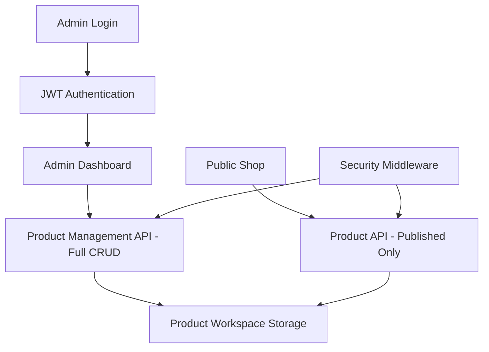

# Admin Dashboard Design Specification

## Overview
This design specifies a password-protected admin dashboard separate from the public shop, allowing authenticated admins to manage products while ensuring customers only see published products. The system integrates with existing authentication, product storage in `product_workspace`, and maintains separation between admin and public interfaces.

## Architecture Overview



## 1. Authentication System

### Login Page
- **Route**: `/admin/login`
- **Method**: GET/POST
- **Frontend**: HTML form with username/password fields, optional MFA
- **Backend**: Uses existing `Backend/auth_service.py` JWT authentication
- **Security**: Rate limiting, audit logging, MFA support for non-owner roles

### JWT Integration
- **Token Expiry**: 24 hours
- **Payload**: username, role, exp, iat, iss
- **Middleware**: `token_required` decorator for admin routes
- **Storage**: HTTP-only cookies or Authorization header

## 2. Admin Dashboard

### Main Dashboard
- **Route**: `/admin/dashboard`
- **Components**:
  - Product list table with status indicators
  - Add/Edit product forms
  - Navigation sidebar
  - Logout functionality

### Product List View
- **Features**:
  - Paginated list of all products (published/unpublished)
  - Sortable columns: name, status, created_date, updated_date
  - Status badges: Draft, Published, Archived
  - Action buttons: Edit, Delete, Toggle Publish

### Product Form (Add/Edit)
- **Fields**:
  - product_id (auto-generated or editable)
  - name
  - collection
  - theme (array)
  - logo_style
  - base_color
  - effects (array)
  - 3d_ready (boolean)
  - published (boolean) - new field
  - status
  - Additional metadata fields as needed

## 3. Backend API Extensions

### Product Data Model
```json
{
  "product_id": "NBL_HOODIE_001",
  "name": "No Limits Beyond Limitations Hoodie 001",
  "collection": "Remembrance",
  "theme": ["Galaxy", "Legacy", "Eternal"],
  "logo_style": "Dripping Melt – Unique Placement",
  "base_color": "Black",
  "effects": ["Cosmic Blend", "Soft Glow"],
  "3d_ready": true,
  "published": false,
  "status": "approved_mockup",
  "created_at": "2024-01-01T00:00:00Z",
  "updated_at": "2024-01-01T00:00:00Z"
}
```

### API Endpoints

#### Authentication
- `POST /api/admin/login` - Login with username/password/MFA, return JWT
- `POST /api/admin/logout` - Invalidate token
- `GET /api/admin/verify` - Verify current token

#### Product Management (Admin Only)
- `GET /api/admin/products` - List all products (with pagination, filtering)
- `GET /api/admin/products/{product_id}` - Get single product
- `POST /api/admin/products` - Create new product
- `PUT /api/admin/products/{product_id}` - Update product
- `DELETE /api/admin/products/{product_id}` - Delete product
- `PATCH /api/admin/products/{product_id}/publish` - Toggle published status

#### Public Product Access
- `GET /api/products/published` - List only published products for shop

### Storage Integration
- **Location**: `product_workspace/products/`
- **Format**: JSON files named `{product_id}.json`
- **Directory Structure**: Organized by category (hoodies/, shirts/, etc.)
- **File Operations**: Read/write JSON files, maintain directory structure

## 4. Security Measures

### Access Control
- **Admin Routes**: Protected by `@token_required` and role checking (admin/owner)
- **Public Routes**: No authentication required, but filter by `published: true`
- **CORS**: Restrict admin routes to specific origins
- **Rate Limiting**: Implement on login and API endpoints

### Data Isolation
- **Admin API**: Full access to all product data
- **Public API**: Filtered query returning only `published: true` products
- **File System**: Admin operations on `product_workspace`, public reads filtered data

### Audit Logging
- **Events**: Login attempts, product CRUD operations, publish status changes
- **Storage**: Append to `Backend/audit.log`
- **Details**: User, timestamp, action, product_id

## 5. File Structure Changes

### New Files
```
web_assets/admin/
├── login.html
├── dashboard.html
├── css/
│   └── admin.css
└── js/
    └── admin.js

web_assets/api/
└── admin_api.py (new blueprint)

Backend/
└── admin_service.py (optional, for product management logic)
```

### Modified Files
- `Backend/shop_app.py`: Add admin blueprint routes
- `web_assets/workshop/dashboard.html`: Add link to admin dashboard
- `product_workspace/products/*.json`: Add `published` field to existing products

## 6. Frontend Components

### Routing
- **Client-side**: Vanilla JS for SPA-like experience
- **Server-side**: Flask routes for initial page loads
- **Navigation**: Hash-based routing for dashboard sections

### Components
- **LoginForm**: Username/password input, error display
- **ProductTable**: Data table with sorting/pagination
- **ProductForm**: Dynamic form with validation
- **StatusIndicator**: Visual badges for product status

### Integration with Existing Systems
- **Authentication**: Reuse `Backend/auth_service.py` for JWT
- **Styling**: Extend `web_assets/css/main.css` or create admin-specific CSS
- **JavaScript**: Build on existing `web_assets/workshop/js/auth.js` patterns
- **Product Data**: Read from/write to `product_workspace` JSON files

## 7. API Response Formats

### Success Response
```json
{
  "success": true,
  "data": { ... },
  "message": "Operation successful"
}
```

### Error Response
```json
{
  "success": false,
  "error": "Error message",
  "code": "ERROR_CODE"
}
```

### Product List Response
```json
{
  "success": true,
  "data": {
    "products": [...],
    "total": 100,
    "page": 1,
    "per_page": 20
  }
}
```

## 8. Error Handling

### Client-side
- Form validation errors
- Network error handling
- Session expiry detection (redirect to login)

### Server-side
- Input validation
- File system error handling
- Database transaction safety (for future DB migration)

## 9. Future Considerations

- **Database Migration**: Move from file-based to database storage
- **Image Upload**: Add support for product image management
- **Bulk Operations**: Import/export products
- **Version Control**: Product change history
- **Multi-user**: Support for multiple admin users with different permissions