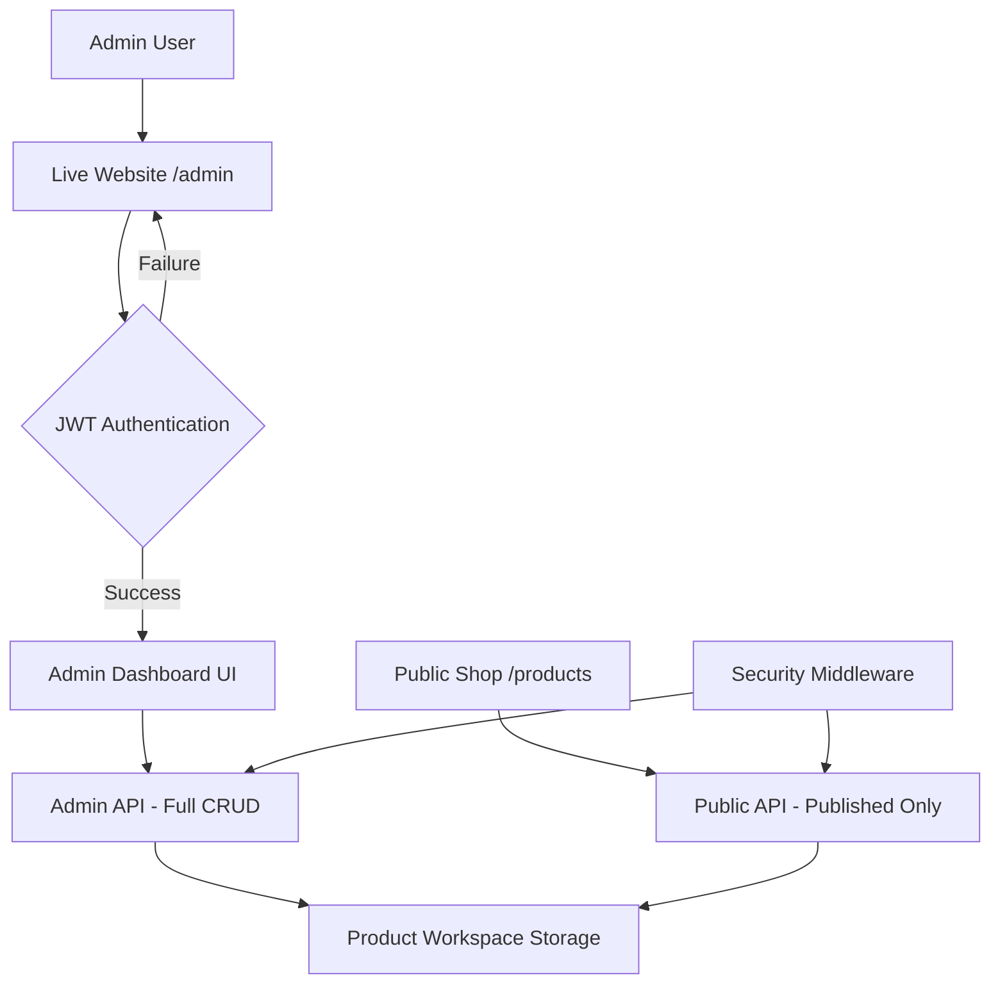

# Private Admin Dashboard Architecture Design

## Overview
This design specifies a secure, web-based admin dashboard accessible from the live website for managing products with password-based authentication, full CRUD operations, and instant synchronization to the public shop without requiring deployment. The admin dashboard (/admin) and public shop (/products) share the same backend and data storage, with authentication separating admin access from public views.

## Architecture Overview



## Core Components

### 1. Authentication System
- **Framework**: JWT-based authentication using existing `Backend/auth_service.py`
- **Login Method**: Password-based with optional MFA
- **Session Management**: HTTP-only cookies with 24-hour expiration
- **Roles**: Admin/Owner access control for dashboard operations
- **Route Protection**: `/admin/*` routes require authentication

### 2. Admin Dashboard UI
- **URL**: `/admin` (password protected)
- **Technology Stack**: HTML5, CSS3, Vanilla JavaScript
- **Layout**: Responsive grid-based design with sidebar navigation
- **Components**:
  - Product list table with sorting, filtering, and pagination
  - Product creation/editing forms with validation
  - Status indicators and action buttons
  - Category management (add/edit/delete categories)
  - Real-time notification system for operations

### 3. Public Shop UI
- **URL**: `/products/*` (public access)
- **Technology Stack**: HTML5, CSS3, Vanilla JavaScript
- **Features**: Display published products by category
- **Security**: No access to admin functions or unpublished products

### 4. Backend API
- **Framework**: Flask with Blueprint architecture
- **Admin Endpoints** (require authentication):
  - `POST /api/admin/login` - Authentication
  - `GET /api/admin/products` - List all products (admin view)
  - `POST /api/admin/products` - Create product
  - `PUT /api/admin/products/{id}` - Update product
  - `DELETE /api/admin/products/{id}` - Delete product
  - `PATCH /api/admin/products/{id}/publish` - Toggle publish status
  - `GET /api/admin/categories` - List categories
  - `POST /api/admin/categories` - Create category
  - `PUT /api/admin/categories/{id}` - Update category
  - `DELETE /api/admin/categories/{id}` - Delete category
- **Public Endpoints** (no authentication):
  - `GET /api/products/published` - List published products
  - `GET /api/products/categories` - List available categories

### 5. Data Persistence
- **Storage**: JSON files in `product_workspace/products/` directory
- **Structure**: Organized by category (hoodies/, shirts/, etc.)
- **Schema**: Extended product model with `published` field
- **Operations**: Direct file I/O with atomic writes and backup
- **Instant Sync**: Changes in admin immediately available to public API

## Detailed Specifications

### Product Data Model
```json
{
  "product_id": "NBL_HOODIE_001",
  "name": "No Limits Beyond Limitations Hoodie 001",
  "collection": "Remembrance",
  "category": "hoodies",
  "theme": ["Galaxy", "Legacy", "Eternal"],
  "logo_style": "Dripping Melt – Unique Placement",
  "base_color": "Black",
  "effects": ["Cosmic Blend", "Soft Glow"],
  "3d_ready": true,
  "published": false,
  "status": "approved_mockup",
  "created_at": "2024-01-01T00:00:00Z",
  "updated_at": "2024-01-01T00:00:00Z"
}
```

### Category Data Model
```json
{
  "category_id": "hoodies",
  "name": "Hoodies",
  "description": "Premium hoodie collection",
  "sort_order": 1,
  "created_at": "2024-01-01T00:00:00Z",
  "updated_at": "2024-01-01T00:00:00Z"
}
```

### Security Architecture
- **Access Control**: Role-based permissions (admin/owner)
- **Route Protection**: `/admin/*` requires authentication
- **API Protection**: JWT token validation on admin endpoints
- **Data Isolation**: Admin sees all products, public sees only published
- **Audit Logging**: All CRUD operations logged to `Backend/audit.log`
- **Rate Limiting**: Login attempts and API calls throttled

### File Structure
```
web_assets/
├── admin/
│   ├── login.html
│   ├── dashboard.html
│   ├── css/
│   │   └── admin.css
│   └── js/
│       └── admin.js
├── products/
│   ├── index.html (public shop)
│   ├── category.html (category view)
│   └── css/
│       └── products.css
├── api/
│   └── admin_api.py (new blueprint)
└── config/
    └── categories.json (category definitions)

Backend/
├── auth_service.py (existing)
└── admin_service.py (business logic for admin operations)

product_workspace/
└── products/
    ├── categories.json
    ├── hoodies/
    ├── shirts/
    └── *.json files
```

### Integration Points
- **Authentication**: Reuse existing JWT implementation
- **Product Storage**: Leverage existing file-based system
- **Routing**: Flask routes for `/admin/*` and `/products/*`
- **Styling**: Inherit from `web_assets/css/main.css`

### Performance Considerations
- **Lazy Loading**: Dashboard components loaded on demand
- **Caching**: Product data cached with file watchers
- **Responsive Design**: Mobile-friendly admin interface
- **Instant Updates**: File-based storage means immediate availability

### Deployment & Maintenance
- **Single Application**: Admin and public shop share same deployment
- **Backup Strategy**: Automatic JSON file backups on changes
- **Monitoring**: API usage and error tracking
- **Version Control**: Product files tracked in git for rollback

## Implementation Roadmap
1. Create admin UI components and routing (/admin)
2. Implement admin API endpoints with full CRUD for products and categories
3. Create public shop UI (/products) with category browsing
4. Add authentication middleware for admin routes
5. Extend product schema with category and published fields
6. Test admin-public separation and instant sync
7. Deploy unified application

This architecture provides a secure admin dashboard accessible from the live website, with instant synchronization to the public shop without requiring separate deployments or manual data transfer.