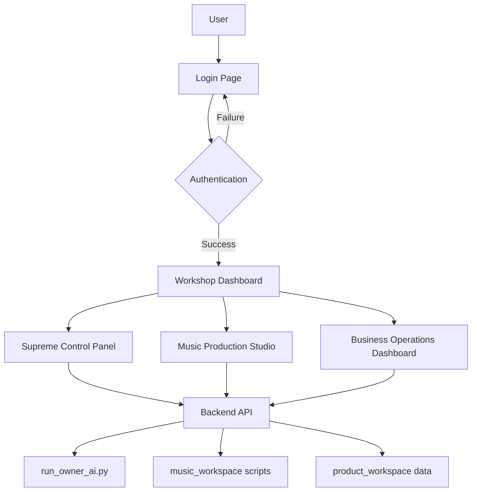

# Private Workshop Feature Architecture Design

## Overview

The private workshop is a secure, web-based interface for managing AI operations, music production, and business activities. It integrates with existing Python scripts and provides a superior user experience surpassing existing music production applications.

## Architecture Overview



## File Structure

```
web_assets/
├── workshop/
│   ├── index.html          # Workshop entry point (login)
│   ├── dashboard.html      # Main dashboard
│   ├── control_panel.html  # Supreme control panel
│   ├── music_studio.html   # Music production UI
│   ├── business_dash.html  # Business operations
│   ├── css/
│   │   ├── workshop.css
│   │   ├── control_panel.css
│   │   ├── music_studio.css
│   │   └── business_dash.css
│   ├── js/
│   │   ├── auth.js
│   │   ├── control_panel.js
│   │   ├── music_studio.js
│   │   └── business_dash.js
│   └── assets/
│       ├── audio/
│       └── icons/
├── api/
│   ├── server.py           # Flask/FastAPI backend
│   ├── auth.py             # Authentication module
│   ├── ai_control.py       # AI operations API
│   ├── music_api.py        # Music production API
│   └── business_api.py     # Business operations API
└── config/
    ├── workshop_config.json
    └── secrets.json        # Hashed passwords, API keys
```

## Authentication Flow

1. User accesses `/workshop/` URL
2. If not authenticated, redirected to login form
3. Password entered and sent to `/api/auth/login`
4. Backend verifies against hashed master password
5. On success, sets secure HTTP-only cookie with session token
6. Redirects to dashboard
7. All subsequent requests include session token for validation

### Security Features
- Password hashing with bcrypt
- Session tokens with expiration (24 hours)
- HTTPS enforcement
- Rate limiting on login attempts
- IP-based blocking after failed attempts

## UI Components

### Login Page
- Minimalist design matching brand aesthetic
- Password input with show/hide toggle
- Error messages for invalid attempts
- Loading states during authentication

### Dashboard
- Grid layout with cards for each feature
- Real-time status indicators
- Quick access buttons
- Notification system for AI operations

### Supreme Control Panel
- Command interface for running AI scripts
- Real-time logs and output display
- Parameter input forms for script customization
- Process monitoring with start/stop controls
- Integration with run_owner_ai.py and music_workspace

### Music Production Studio
- Multi-track timeline interface
- Waveform visualization with zoom/pan
- Beat library browser with preview
- Lyrics editor with real-time sync
- Export controls for various formats
- Advanced effects panel (EQ, compression, reverb)
- Collaboration features (save/load projects)
- Integration with OwnerMusicAI class methods

### Business Operations Dashboard
- KPI metrics cards (revenue, products, orders)
- Charts for sales trends and analytics
- Product inventory management
- Order tracking and fulfillment
- Customer data visualization
- Export reports functionality
- Integration with product_workspace data

## Backend Integration Points

### AI Control API
- `POST /api/ai/run_owner` - Execute run_owner_ai.py
- `GET /api/ai/status` - Get current AI operation status
- `POST /api/ai/music/generate_beat` - Generate beat via music_workspace
- `POST /api/ai/music/generate_lyrics` - Generate lyrics
- `POST /api/ai/music/produce_song` - Combine beat and lyrics

### Music API
- `GET /api/music/projects` - List music projects
- `POST /api/music/projects` - Create new project
- `GET /api/music/beats` - List available beats
- `GET /api/music/lyrics` - List generated lyrics
- `POST /api/music/upload` - Upload custom audio files

### Business API
- `GET /api/business/metrics` - Get dashboard metrics
- `GET /api/business/products` - List products
- `POST /api/business/products` - Add/update products
- `GET /api/business/orders` - List orders
- `POST /api/business/orders` - Create orders

## Technology Stack

### Frontend
- HTML5, CSS3, JavaScript (ES6+)
- Web Audio API for music production
- Canvas/SVG for visualizations
- Fetch API for backend communication
- Local storage for session persistence

### Backend
- Python Flask or FastAPI
- Subprocess module for running Python scripts
- SQLite/PostgreSQL for data persistence
- JWT for session management
- CORS for cross-origin requests

### Integration
- Direct subprocess calls to existing scripts
- File system monitoring for output files
- JSON API communication between components
- WebSocket for real-time updates (optional)

## Performance Considerations

- Lazy loading of heavy components (music studio)
- Caching of frequently accessed data
- Asynchronous processing for long-running AI tasks
- Optimized audio file handling
- Responsive design for mobile access

## Security Considerations

- All API endpoints require authentication
- Input validation and sanitization
- Secure file upload handling
- No direct script execution from frontend
- Environment variable usage for sensitive data
- Regular security audits and updates

## Deployment

- Containerized with Docker
- Nginx reverse proxy
- SSL certificate configuration
- Backup strategies for data and configurations
- Monitoring and logging setup