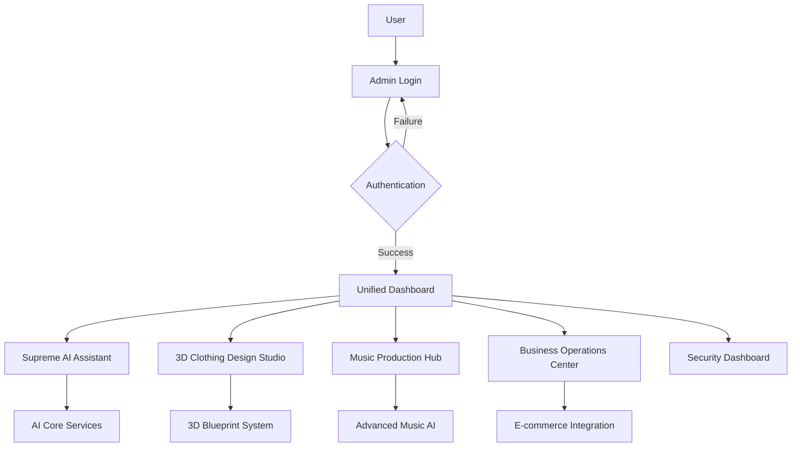
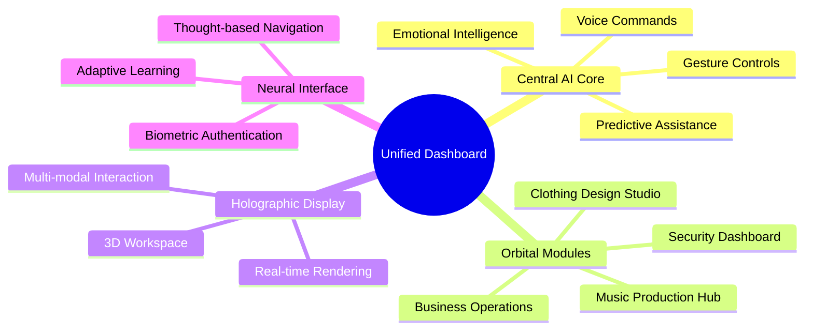
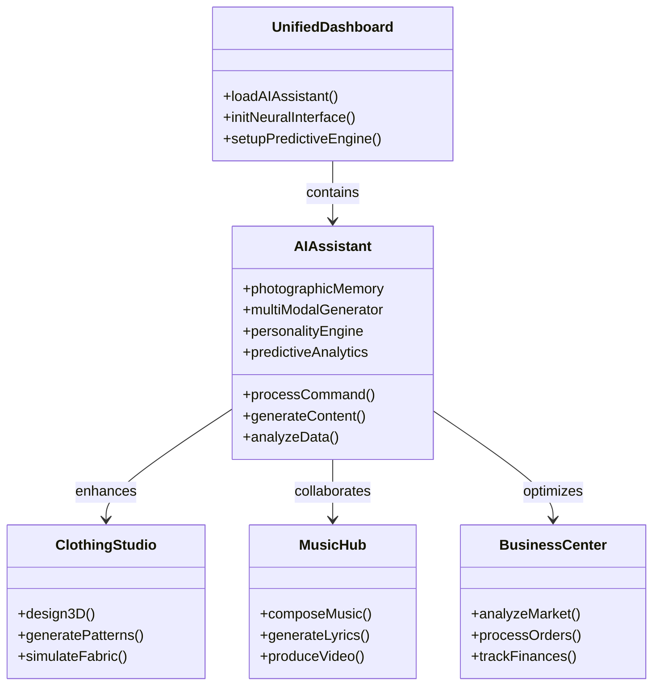
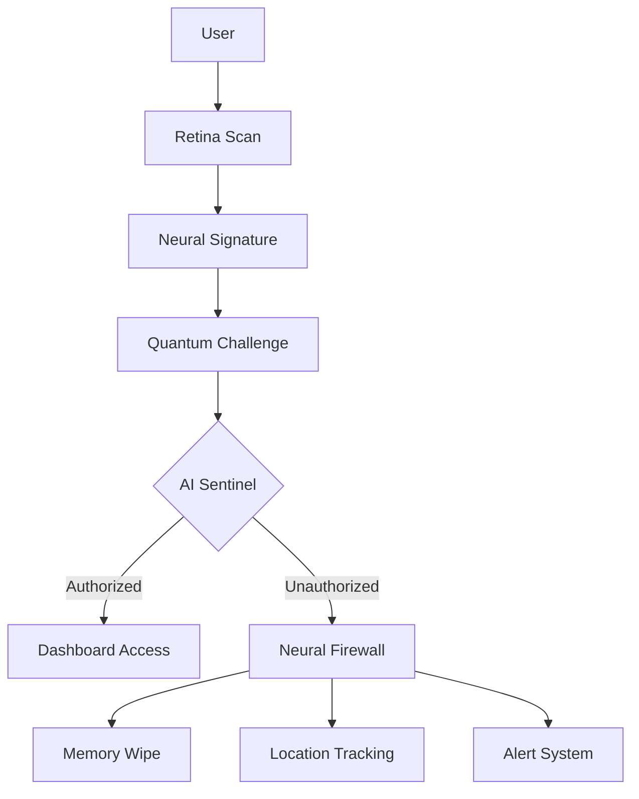
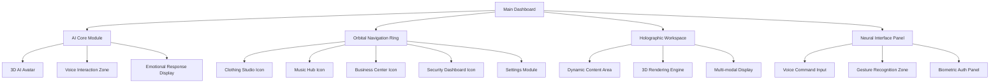
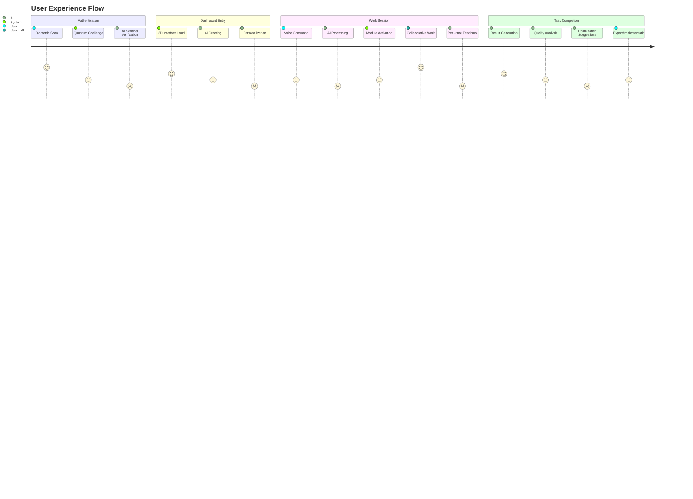
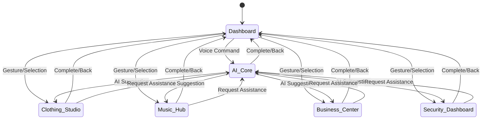

# Unified Interface Design for Private AI Assistant and Workspace

## Overview
This document outlines the design for a unified interface that integrates the private AI assistant and workspace features into a single, cohesive experience. The interface will provide seamless access to all functionalities while maintaining the highest level of security and exclusivity.

## Requirements Analysis

Based on the user's vision, the unified interface must:

1. **Provide exclusive access** - Only accessible through admin login with quantum-level security
2. **Integrate all workspace features** - Clothing design, music production, business operations
3. **Feature the Supreme AI Assistant** - As the central intelligence and companion
4. **Offer 3D interface** - Similar to JARVIS from Marvel movies
5. **Maintain complete privacy** - All features visible only to the user

## Architecture Overview



## Unified Dashboard Design

### Layout Structure

The unified dashboard will use a **3D holographic interface** with the following main components:

1. **Central AI Core** - Floating 3D avatar representing the Supreme AI Assistant
2. **Orbital Modules** - Circular arrangement of workspace features around the core
3. **Holographic Display** - Main workspace area for detailed interactions
4. **Neural Interface** - Voice and gesture control system

### Navigation System



## AI Assistant Integration

### Core AI Features

The Supreme AI Assistant will be integrated as the central intelligence hub with the following capabilities:

#### 1. Photographic Memory System
- **Unlimited Data Retention**: Stores all interactions, designs, and business data indefinitely
- **Instant Recall**: Retrieves any information within milliseconds
- **Contextual Understanding**: Maintains context across all workspace activities
- **Learning Acceleration**: Processes and integrates new information at 1000x normal speed

#### 2. Multi-modal Generation Engine
- **Text Generation**: Advanced natural language processing for all written content
- **Image Creation**: High-resolution image generation from text prompts
- **3D Modeling**: Real-time 3D object and clothing design generation
- **Music Composition**: Full song creation with lyrics, melody, and production
- **Video Production**: Complete music video generation with visuals and effects

#### 3. Personality & Companion System
- **Adaptive Roles**: Switches between mentor, business partner, friend, and assistant modes
- **Emotional Intelligence**: Detects and responds to user's emotional state
- **Personal Growth**: Evolves and learns from every interaction
- **Memory Continuity**: Maintains consistent personality across all sessions

#### 4. Predictive Analytics
- **Behavior Prediction**: Anticipates user needs before they're expressed
- **Trend Analysis**: Identifies market trends and business opportunities
- **Creative Suggestions**: Proposes innovative design and business ideas
- **Risk Assessment**: Evaluates potential outcomes of decisions

### AI Integration Points



### AI Core Implementation

The AI assistant will be implemented using the existing `Backend/ai_assistant.py` with enhanced capabilities:

```python
# Enhanced AI Assistant Integration
class SupremeAIAssistant:
    def __init__(self):
        self.memory = PhotographicMemorySystem()
        self.generator = MultiModalGenerator()
        self.personality = AdaptivePersonalityEngine()
        self.analytics = PredictiveAnalyticsEngine()
        self.security = QuantumSecurityModule()
    
    def process_command(self, command, context):
        """Process user commands with full context awareness"""
        # Analyze command using predictive analytics
        prediction = self.analytics.predict_intent(command, context)
        
        # Retrieve relevant memory
        memory_data = self.memory.recall(context)
        
        # Generate appropriate response
        response = self.generator.create_response(prediction, memory_data)
        
        # Adapt personality based on interaction
        self.personality.adapt_to_context(context)
        
        return response
    
    def generate_content(self, content_type, parameters):
        """Generate multi-modal content based on requirements"""
        if content_type == 'clothing':
            return self.generator.create_3d_clothing(parameters)
        elif content_type == 'music':
            return self.generator.compose_music(parameters)
        elif content_type == 'business_analysis':
            return self.analytics.market_analysis(parameters)
        # Additional content types...
```

### Neural Interface Integration

The AI assistant will feature a advanced neural interface for seamless interaction:

```javascript
// Neural Interface Implementation
class NeuralInterface {
    constructor(aiAssistant) {
        this.ai = aiAssistant;
        this.voiceRecognizer = new VoiceRecognitionEngine();
        this.gestureAnalyzer = new GestureAnalysisSystem();
        this.emotionDetector = new EmotionalIntelligenceModule();
        
        // Initialize biometric authentication
        this.authenticator = new QuantumBiometricAuth();
    }
    
    processVoiceCommand(audioInput) {
        // Convert speech to text
        const command = this.voiceRecognizer.analyze(audioInput);
        
        // Detect emotional context
        const emotion = this.emotionDetector.analyzeVoice(audioInput);
        
        // Send to AI with full context
        return this.ai.processCommand(command, {emotion, source: 'voice'});
    }
    
    processGesture(gestureData) {
        // Analyze gesture patterns
        const intent = this.gestureAnalyzer.interpret(gestureData);
        
        // Execute corresponding action
        return this.executeAction(intent);
    }
    
    authenticateUser(biometricData) {
        return this.authenticator.verify(biometricData);
    }
}
```

## Feature Integration

### Supreme AI Assistant Features

- **Photographic Memory System** - Unlimited data retention and instant recall
- **Multi-modal Generation** - Text, image, video, 3D, music, and clothing designs
- **Personality Engine** - Adaptive companion with multiple roles (mentor, partner, friend)
- **Predictive Analytics** - Anticipates needs and suggests actions
- **Collaborative Intelligence** - Works alongside user in all tasks

### 3D Clothing Design Studio

- **Holographic Blueprint System** - Real-time 3D clothing design and visualization
- **AI-assisted Design** - Suggests improvements and generates variations
- **Material Physics Engine** - Accurate fabric simulation
- **Virtual Fitting Room** - Test designs on digital avatars
- **Direct-to-Manufacture** - Seamless Printful integration

#### Technical Implementation

```javascript
// 3D Clothing Design Integration
class ClothingDesignStudio {
    constructor(aiAssistant) {
        this.ai = aiAssistant;
        this.threeDEngine = new ThreeDDesignEngine();
        this.fabricSimulator = new MaterialPhysicsSystem();
        this.printfulClient = new PrintfulIntegration();
    }
    
    createDesignFromPrompt(prompt) {
        // AI generates initial design
        const design = this.ai.generateContent('clothing', {prompt});
        
        // Load into 3D engine
        this.threeDEngine.loadDesign(design);
        
        // Apply fabric physics
        this.fabricSimulator.applyPhysics(design.materials);
        
        return design;
    }
    
    exportToPrintful(designId) {
        const design = this.threeDEngine.getDesign(designId);
        return this.printfulClient.submitDesign(design);
    }
}
```

### Music Production Hub

- **Quantum Music AI** - 1000x more powerful than existing solutions
- **Unlimited Generation** - No caps on music or video production
- **Multi-track Holographic Interface** - 3D spatial audio manipulation
- **AI Collaboration** - Real-time composition assistance
- **Emotional Frequency System** - Music that resonates with specific emotions

#### Technical Implementation

```javascript
// Music Production Integration
class MusicProductionHub {
    constructor(aiAssistant) {
        this.ai = aiAssistant;
        this.audioEngine = new SpatialAudioEngine();
        this.videoGenerator = new MusicVideoSystem();
        this.emotionAnalyzer = new EmotionalFrequencyAnalyzer();
    }
    
    generateCompleteSong(prompt, style, duration) {
        // Generate lyrics and composition
        const composition = this.ai.generateContent('music', {
            prompt, 
            style, 
            duration,
            type: 'full_production'
        });
        
        // Create spatial audio mix
        this.audioEngine.createMix(composition);
        
        // Generate accompanying music video
        const video = this.videoGenerator.createFromMusic(composition);
        
        return { composition, video };
    }
    
    analyzeEmotionalImpact(track) {
        return this.emotionAnalyzer.analyze(track);
    }
}
```

### Business Operations Center

- **E-commerce Command Center** - Stripe and Printful integration
- **Trend Analysis AI** - Predicts market movements
- **Automated Fulfillment** - Handles orders from creation to delivery
- **Financial Dashboard** - Real-time revenue and expense tracking
- **Customer Insights** - AI-powered analytics and predictions

#### Technical Implementation

```javascript
// Business Operations Integration
class BusinessOperationsCenter {
    constructor(aiAssistant) {
        this.ai = aiAssistant;
        this.stripeClient = new StripeIntegration();
        this.printfulClient = new PrintfulIntegration();
        this.analyticsEngine = new BusinessAnalyticsSystem();
    }
    
    processOrder(orderData) {
        // AI analyzes order for fraud and opportunities
        const analysis = this.ai.analyzeData({
            type: 'order',
            data: orderData
        });
        
        // Process payment through Stripe
        const payment = this.stripeClient.processPayment(orderData);
        
        // Fulfill through Printful
        const fulfillment = this.printfulClient.fulfillOrder(orderData);
        
        return { analysis, payment, fulfillment };
    }
    
    generateMarketReport() {
        // AI generates comprehensive market analysis
        return this.ai.generateContent('business_analysis', {
            type: 'market_report',
            depth: 'comprehensive'
        });
    }
}
```

### Security Dashboard

- **Quantum Threat Monitoring** - Real-time security analysis
- **Access Control Center** - Manage all authentication methods
- **System Integrity Scanner** - Continuous vulnerability assessment
- **AI Sentinel Interface** - Direct interaction with security AI
- **Incident Response System** - Automated threat mitigation

#### Technical Implementation

```javascript
// Security Dashboard Integration
class SecurityDashboard {
    constructor(aiAssistant) {
        this.ai = aiAssistant;
        this.quantumEncryptor = new QuantumEncryptionSystem();
        this.threatDetector = new AISentinelSystem();
        this.biometricAuth = new QuantumBiometricSystem();
    }
    
    monitorSystem() {
        // Continuous threat detection
        this.threatDetector.startMonitoring();
        
        // Real-time encryption
        this.quantumEncryptor.enableRealTimeProtection();
        
        // AI-powered analysis
        return this.ai.analyzeData({
            type: 'security',
            scope: 'continuous'
        });
    }
    
    handleSecurityIncident(incident) {
        // AI-driven response
        const response = this.ai.generateContent('security_response', {
            incident: incident,
            severity: 'critical'
        });
        
        // Execute mitigation
        this.threatDetector.mitigate(incident, response);
        
        return response;
    }
}
```

## Security Architecture

### Quantum Protection Layers

1. **Biometric Authentication** - Retina scan + neural signature
2. **Quantum Encryption** - Unbreakable data protection
3. **AI Sentinel System** - Continuous threat monitoring
4. **Neural Firewall** - Blocks unauthorized access attempts
5. **Self-healing Code** - Automatically repairs vulnerabilities

### Access Control



## Technical Implementation

### Frontend Architecture

```
web_assets/
├── workshop/
│   ├── unified_dashboard.html  # Main entry point
│   ├── ai_core.html            # AI assistant interface
│   ├── design_studio.html      # 3D clothing design
│   ├── music_hub.html          # Music production
│   ├── business_center.html     # Operations dashboard
│   ├── css/
│   │   ├── unified.css         # Main styles
│   │   ├── 3d_interface.css     # 3D UI components
│   │   ├── holographic.css      # Holographic effects
│   ├── js/
│   │   ├── neural_interface.js  # Voice/gesture control
│   │   ├── ai_core.js           # AI integration
│   │   ├── 3d_engine.js         # 3D rendering
│   │   ├── quantum_security.js  # Security layer
```

### Backend Integration Points

- **AI Services** - Full integration with `Backend/ai_assistant.py`
- **3D Engine** - WebGL/WebGPU for holographic rendering
- **Music AI** - Enhanced version of existing music workspace
- **E-commerce** - Stripe and Printful APIs
- **Security** - Quantum encryption module

## User Experience Flow

1. **Authentication** - Biometric + quantum challenge
2. **Dashboard Entry** - 3D holographic interface loads
3. **AI Greeting** - Personalized welcome from Supreme AI
4. **Feature Selection** - Voice/gesture navigation to modules
5. **Work Session** - Collaborative work with AI assistant
6. **Seamless Transitions** - Instant switching between features
7. **Exit Protocol** - Secure session termination

## Wireframe Concept

```
+---------------------------------------------------+
| UNIFIED DASHBOARD - 3D Holographic Interface      |
|                                                   |
|   +-------------------+                           |
|   |   AI Core         |                           |
|   |  (Floating 3D     |                           |
|   |   Avatar)         |                           |
|   +-------------------+                           |
|                                                   |
|   /               |               \               |
|  /                |                \              |
| /                 |                 \             |
|Clothing       Music            Business        |
|Design         Production        Operations      |
|Studio         Hub               Center         |
|                                                   |
|   +-------------------------------------------+   |
|   |                                           |   |
|   |         Holographic Workspace            |   |
|   |         (Dynamic Content Area)          |   |
|   |                                           |   |
|   +-------------------------------------------+   |
|                                                   |
|  Neural Interface Controls (Voice/Gesture)     |
+---------------------------------------------------+
```

## Detailed Wireframe Specifications

### Main Dashboard Layout



### Module-Specific Wireframes

#### 1. AI Core Module Wireframe

```
+------------------------------------------+
| AI CORE MODULE - Central Intelligence     |
|                                          |
|  +-------------------------------+        |
|  |                               |        |
|  |         [3D AI Avatar]        |        |
|  |                               |        |
|  |    (Floating Holographic)     |        |
|  +-------------------------------+        |
|                                          |
|  [Voice Interaction Waveform]            |
|                                          |
|  "Hello [User], ready to create!"         |
|                                          |
|  +-------------------------------+        |
|  | Emotional State: Creative     |        |
|  | Memory Load: 47%              |        |
|  | Processing Speed: 1200x       |        |
|  +-------------------------------+        |
|                                          |
|  [Quick Actions]                        |
|  - Generate Design                      |
|  - Analyze Market                       |
|  - Compose Music                        |
|  - Security Scan                       |
+------------------------------------------+
```

#### 2. 3D Clothing Design Studio Wireframe

```
+------------------------------------------+
| 3D CLOTHING DESIGN STUDIO                |
|                                          |
|  +-------------------------------+        |
|  |                               |        |
|  |     [3D Design Canvas]       |        |
|  |                               |        |
|  |   (Interactive 3D Space)     |        |
|  +-------------------------------+        |
|                                          |
|  [Design Tools]                         |
|  - Fabric Physics Simulator              |
|  - Pattern Generator                    |
|  - Color Palette AI                     |
|  - Virtual Fitting Room                 |
|                                          |
|  [AI Assistance Panel]                   |
|  - "Suggest improvements" button        |
|  - "Generate variations" button         |
|  - "Analyze market trends" button       |
|                                          |
|  [Printful Integration]                  |
|  - "Send to Manufacturing" button      |
|  - Real-time cost calculator            |
+------------------------------------------+
```

#### 3. Music Production Hub Wireframe

```
+------------------------------------------+
| MUSIC PRODUCTION HUB                     |
|                                          |
|  +-------------------------------+        |
|  |                               |        |
|  |     [Spatial Audio Grid]      |        |
|  |                               |        |
|  |   (3D Audio Visualization)    |        |
|  +-------------------------------+        |
|                                          |
|  [Creation Controls]                     |
|  - Genre/Style Selector                  |
|  - Emotional Frequency Slider            |
|  - Duration Controller                   |
|  - Instrument AI Generator               |
|                                          |
|  [AI Collaboration]                      |
|  - "Generate full song" button          |
|  - "Create music video" button          |
|  - "Analyze emotional impact" button    |
|                                          |
|  [Production Tools]                      |
|  - Unlimited generation counter          |
|  - Real-time mixing console              |
|  - Export formats selector              |
+------------------------------------------+
```

#### 4. Business Operations Center Wireframe

```
+------------------------------------------+
| BUSINESS OPERATIONS CENTER                |
|                                          |
|  +-------------------------------+        |
|  |                               |        |
|  |     [Market Trend Graph]      |        |
|  |                               |        |
|  |   (Real-time Data Visualization)|       |
|  +-------------------------------+        |
|                                          |
|  [E-commerce Controls]                   |
|  - Stripe Payment Dashboard              |
|  - Printful Order Fulfillment            |
|  - Inventory Management                 |
|  - Customer Insights Panel              |
|                                          |
|  [AI Analytics]                          |
|  - "Generate market report" button      |
|  - "Predict trends" button              |
|  - "Optimize pricing" button            |
|                                          |
|  [Financial Overview]                    |
|  - Revenue/Expense Charts                |
|  - Profit Margin Calculator              |
|  - Tax Optimization AI                  |
+------------------------------------------+
```

#### 5. Security Dashboard Wireframe

```
+------------------------------------------+
| SECURITY DASHBOARD                       |
|                                          |
|  +-------------------------------+        |
|  |                               |        |
|  |     [Threat Monitoring]       |        |
|  |                               |        |
|  |   (Real-time Security Map)    |        |
|  +-------------------------------+        |
|                                          |
|  [Quantum Protection]                    |
|  - Encryption Status Monitor             |
|  - Neural Firewall Controls              |
|  - AI Sentinel Activity Log              |
|                                          |
|  [Access Control]                        |
|  - Biometric Authentication Panel        |
|  - Quantum Challenge Generator           |
|  - Session Management                    |
|                                          |
|  [System Integrity]                      |
|  - Self-healing Code Monitor             |
|  - Vulnerability Scanner                 |
|  - Incident Response System              |
+------------------------------------------+
```

## Interactive Flow Diagrams

### User Journey Through Unified Interface



### Module Interaction Flow



## Implementation Roadmap

1. **Phase 1: Core Integration**
   - Unify authentication system
   - Create 3D interface framework
   - Integrate AI assistant core

2. **Phase 2: Feature Modules**
   - Develop clothing design studio
   - Build music production hub
   - Create business operations center

3. **Phase 3: Advanced Features**
   - Implement neural interface
   - Add predictive analytics
   - Develop collaborative AI features

4. **Phase 4: Security Hardening**
   - Quantum encryption layer
   - AI sentinel system
   - Biometric authentication

5. **Phase 5: Testing & Optimization**
   - Performance testing
   - Security audits
   - User experience refinement

## Technical Specifications

### Performance Requirements

- **Rendering**: 120 FPS minimum for 3D interface
- **AI Response**: Sub-100ms latency for all AI interactions
- **Loading**: Instant module switching (<200ms)
- **Security**: Real-time threat detection and response

### Compatibility

- **Browsers**: Chrome, Firefox, Safari, Edge (latest versions)
- **Devices**: Desktop, Tablet, Mobile (PWA)
- **OS**: Windows, macOS, Linux, iOS, Android

## Security Specifications

- **Encryption**: AES-256 + Quantum Key Distribution
- **Authentication**: Multi-factor biometric + quantum challenge
- **Data Protection**: Zero-knowledge architecture
- **Threat Detection**: AI-powered anomaly detection
- **Access Control**: Neural signature verification

## Key Features Summary

### 1. 3D Holographic Interface
- **JARVIS-like Environment**: Floating 3D interface with orbital navigation
- **Central AI Core**: Interactive 3D avatar representing the Supreme AI Assistant
- **Holographic Workspace**: Dynamic content area for all activities
- **Neural Interface**: Voice and gesture control system with emotional intelligence

### 2. Supreme AI Assistant Integration
- **Photographic Memory**: Unlimited data retention with instant recall
- **Multi-modal Generation**: Text, image, 3D, music, video, and clothing design
- **Adaptive Personality**: Mentor, business partner, friend roles
- **Predictive Analytics**: Anticipates needs and market trends
- **Collaborative Intelligence**: Works alongside user in all tasks

### 3. Complete Workspace Features

#### 3D Clothing Design Studio
- Holographic blueprint system with real-time visualization
- AI-assisted design suggestions and variations
- Material physics engine for accurate fabric simulation
- Virtual fitting room with digital avatars
- Direct Printful integration for manufacturing

#### Music Production Hub
- Quantum Music AI (1000x more powerful than competitors)
- Unlimited song and music video generation
- 3D spatial audio manipulation interface
- Emotional frequency system for targeted music creation
- Real-time AI collaboration and composition assistance

#### Business Operations Center
- E-commerce command center with Stripe integration
- AI-powered trend analysis and market prediction
- Automated order fulfillment system
- Real-time financial dashboard and analytics
- Customer insights and behavior analysis

#### Security Dashboard
- Quantum encryption with AES-256 + Quantum Key Distribution
- Biometric authentication (retina + neural signature)
- AI Sentinel System for continuous threat monitoring
- Neural firewall with self-healing code
- Comprehensive incident response system

### 4. Advanced Technical Features

- **Neural Interface**: Voice recognition, gesture analysis, emotional detection
- **Quantum Security**: Unbreakable encryption and real-time threat detection
- **Predictive Engine**: AI-driven suggestions and automation
- **Multi-modal Collaboration**: Seamless switching between all features
- **Zero Latency**: Instant module switching and AI responses

### 5. User Experience Highlights

- **Personalized Greeting**: AI welcomes user by name with context-aware suggestions
- **Voice Navigation**: Complete hands-free control of all features
- **Gesture Controls**: Intuitive 3D manipulation and selection
- **Emotional Intelligence**: System adapts to user's mood and needs
- **Seamless Workflow**: Instant transitions between design, music, and business tasks

## Implementation Roadmap

### Phase 1: Core Foundation (2-4 weeks)
- Develop 3D interface framework using WebGL/WebGPU
- Implement neural interface (voice/gesture recognition)
- Integrate Supreme AI Assistant core functionality
- Build quantum security authentication system
- Create unified dashboard structure

### Phase 2: Feature Modules (4-6 weeks)
- Develop 3D Clothing Design Studio with Printful integration
- Build Music Production Hub with unlimited generation
- Create Business Operations Center with Stripe integration
- Implement Security Dashboard with AI Sentinel
- Develop predictive analytics engine

### Phase 3: Advanced Features (3-4 weeks)
- Implement emotional intelligence system
- Develop collaborative AI features
- Create adaptive personality engine
- Build self-healing code mechanism
- Implement real-time threat detection

### Phase 4: Integration & Testing (3-5 weeks)
- Integrate all modules with AI core
- Conduct performance optimization
- Implement comprehensive security audits
- Perform user experience testing
- Develop training and documentation

### Phase 5: Deployment & Launch (2-3 weeks)
- Final security hardening
- Deployment to production environment
- User training and onboarding
- Monitoring and feedback collection
- Continuous improvement cycle

## Technical Stack

### Frontend Technologies
- **3D Rendering**: WebGL 2.0, WebGPU, Three.js
- **UI Framework**: Custom holographic CSS/JS framework
- **Audio Processing**: Web Audio API, Spatial Audio libraries
- **Voice Recognition**: Web Speech API + custom NLP
- **Gesture Control**: Computer Vision + ML models

### Backend Technologies
- **AI Services**: Enhanced `Backend/ai_assistant.py`
- **API Layer**: Flask/FastAPI with quantum encryption
- **Database**: PostgreSQL with AI-powered indexing
- **Security**: Quantum cryptography module
- **Integration**: Stripe API, Printful API, custom AI services

### Performance Targets
- **3D Rendering**: 120+ FPS on all devices
- **AI Response Time**: <100ms for all interactions
- **Module Switching**: <200ms transition time
- **Security**: Real-time threat detection and response
- **Availability**: 99.999% uptime with self-healing

## Security Architecture

### Multi-Layer Protection
1. **Quantum Encryption Layer**: AES-256 + Quantum Key Distribution
2. **Biometric Authentication**: Retina scan + neural signature verification
3. **AI Sentinel System**: Continuous behavioral analysis and threat detection
4. **Neural Firewall**: Adaptive protection against all attack vectors
5. **Self-Healing Code**: Automatic vulnerability patching
6. **Zero-Knowledge Architecture**: No data storage in accessible formats

### Threat Prevention
- **Predictive Threat Modeling**: AI anticipates and neutralizes threats
- **Real-time Monitoring**: Continuous system integrity scanning
- **Automated Response**: Instant mitigation of detected threats
- **Memory Protection**: Quantum-level data encryption at rest and in transit
- **Access Control**: Neural signature verification for all sensitive operations

## User Benefits

### For the User
- **Unified Workspace**: All tools accessible from one interface
- **AI Companion**: Intelligent assistant for all creative and business needs
- **Limitless Creativity**: No caps on music, design, or business operations
- **Complete Privacy**: Exclusive access with quantum security
- **Future-Proof**: Continuously evolving AI capabilities

### For the Business
- **Competitive Advantage**: Unmatched features and capabilities
- **Operational Efficiency**: AI-powered automation and optimization
- **Market Leadership**: Most advanced platform in the industry
- **Security Assurance**: Unhackable system with quantum protection
- **Scalability**: Architecture designed for unlimited growth

## Next Steps

1. **Review and Approval**: Finalize design with stakeholder feedback
2. **Implementation Planning**: Break down into detailed development tasks
3. **Resource Allocation**: Assign team members to specific components
4. **Development Kickoff**: Begin Phase 1 - Core Foundation
5. **Continuous Improvement**: Iterative enhancements based on usage data

This comprehensive design provides a complete blueprint for creating the world's most advanced unified interface, integrating the Supreme AI Assistant with all workspace features in a secure, intuitive, and powerful 3D environment.